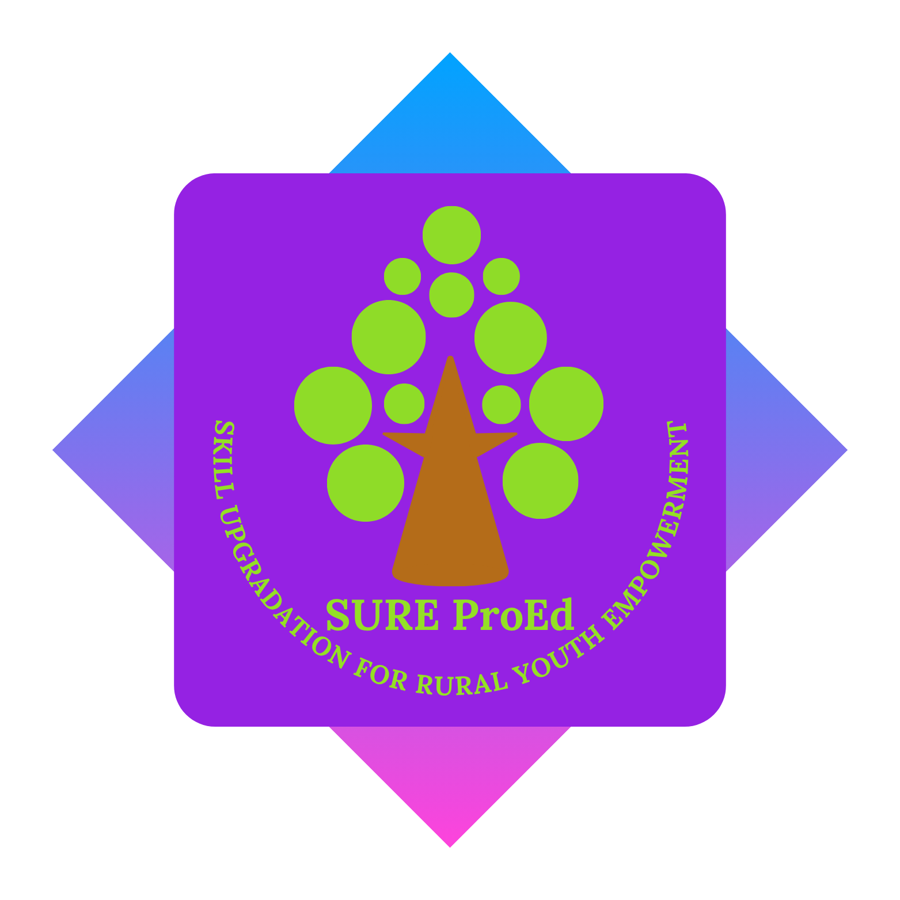

  

<h1 align="center">SURE ProEd (formerly SURE Trust)</h1>

  <strong>Skill Upgradation for Rural Youth Empowerment Trust</strong>

# 🎓 Student Performance Prediction System

**Machine Learning–Based Academic Outcome Analysis**

---

## 👤 Student Details

* **Name:** Mohd Kaunain
* **Email ID:** [mohdkaunaing7ds@gmail.com](mailto:mohdkaunaing7ds@gmail.com)
* **College Name:** Amity University, Noida
* **Branch / Specialization:** B.Tech – Computer Science Engineering (Data Science)

---

## 📘 Course Details

* **Course Opted:** Data Analytics and Data Science
* **Instructor Name:** Mr. Bhargavesh Dakka
* **Duration:** 6 Months

---

## 👨‍🏫 Trainer Details

* **Trainer Name:** Mr. Bhargavesh Dakka
* **Trainer Email ID:** [bhargaveshdakka@gmail.com](mailto:bhargaveshdakka@gmail.com)
* **Trainer Designation:** Data Scientist at MuSigma

---

## 📑 Table of Contents

1. Course Learning
2. Projects Completed
3. Project Introduction
4. Technologies Used
5. Roles and Responsibilities
6. Project Report
7. Learnings from LST & SST
8. Community Services
9. Certificate
10. Acknowledgments
11. Overall Learning

---

## 📖 Overall Learning

During this course, I gained a strong foundation in **Data Analytics and Data Science** with practical exposure to real-world datasets and machine learning workflows. I developed hands-on experience in **Python programming, data preprocessing, exploratory data analysis (EDA), feature engineering, model building, and evaluation**.

The course strengthened my understanding of how data-driven approaches can be applied to solve real-life problems, especially in the education and analytics domain. I also improved my analytical thinking, problem-solving abilities, and technical documentation skills.

---

## 🧠 Projects Completed

### **Project 1: Student Performance Prediction System**

---

## 📌 Project Introduction

Educational institutions generate vast amounts of student-related data, but manually analyzing this data to understand academic performance trends is challenging and time-consuming.

The **Student Performance Prediction System** is a machine learning–based project designed to predict students’ academic outcomes using demographic, socio-economic, and academic features. The project demonstrates how predictive analytics can assist institutions in identifying performance patterns and supporting students more effectively.

A dataset containing approximately **1 million student records** was used, following a complete data science pipeline including data cleaning, EDA, model training, evaluation, and comparison.

---

## 🛠 Technologies Used

* **Programming Language:** Python
* **Libraries & Frameworks:**

  * Pandas
  * NumPy
  * scikit-learn
  * XGBoost
* **Data Visualization:**

  * Matplotlib
  * Seaborn

---

## 👨‍💻 Roles and Responsibilities

* Collected and analyzed large-scale student performance data
* Performed data cleaning and preprocessing to handle missing and inconsistent values
* Conducted Exploratory Data Analysis (EDA) to identify trends and correlations
* Built and trained multiple machine learning classification models
* Evaluated model performance using accuracy, F1-score, and confusion matrix
* Compared ensemble models to baseline models for optimal performance
* Documented results and findings in a structured and professional format

---

## 📑 Project Report

The detailed project report includes:

* Dataset overview and preprocessing steps
* Exploratory Data Analysis with visualizations
* Machine learning model implementation
* Performance evaluation and comparison
* Final conclusions and insights

🔗 **Project Presentation (PPT):**
[https://docs.google.com/presentation/d/1ak0ilTJnwNxBwKrompxRujpiIBN79B-oO9yLjdahXcs/edit?usp=sharing](https://docs.google.com/presentation/d/1ak0ilTJnwNxBwKrompxRujpiIBN79B-oO9yLjdahXcs/edit?usp=sharing)

---

## 🎯 Learnings from LST & SST

The **Life Skills Training (LST)** and **Soft Skills Training (SST)** sessions played a significant role in my personal and professional development. These sessions emphasized the importance of **self-discipline, time management, teamwork, and professional ethics**.

I improved my **communication skills**, including clarity in verbal expression, active listening, and professional body language. The training also helped me gain confidence in **presentations, interviews, and collaborative work environments**, preparing me for real-world industry challenges.

---

## 🌱 Community Services

During the internship period, I actively participated in community-oriented initiatives aimed at promoting social responsibility and awareness. These activities helped me understand the importance of contributing to society alongside technical and professional growth.

### Activities Involved

* Participation in community awareness initiatives
* Supporting social responsibility and collaborative efforts

### Impact / Contribution

* Developed a sense of empathy and civic responsibility
* Strengthened interpersonal and communication skills
* Gained exposure to teamwork beyond academic and technical domains

---

## 📜 Certificate

The internship certificate serves as official recognition of the successful completion of the **Data Analytics and Data Science** training program. It validates the technical skills, learning outcomes, and project contributions achieved during the internship period.

---

## 🙏 Acknowledgments

I would like to express my sincere gratitude to everyone who supported and guided me throughout this learning journey.

I am deeply thankful to **Mr. Bhargavesh Dakka**, my trainer, for his continuous guidance, mentorship, and valuable insights during the course. His expertise and encouragement played a crucial role in the successful completion of my project.

I also extend my gratitude to my college faculty and mentors for providing the academic environment and support that enabled me to enhance my technical and professional skills.
